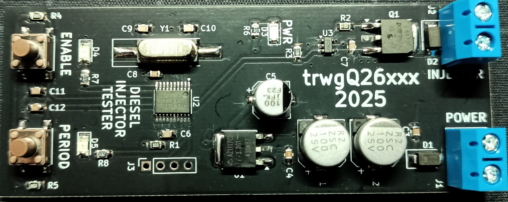
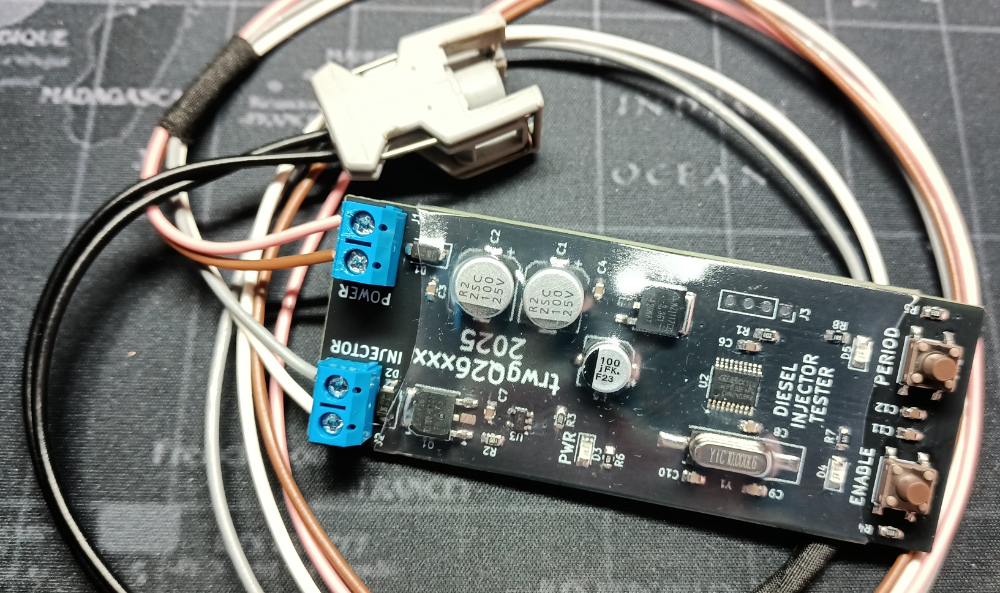

# Diesel Injector Tester

**A small tester generating short 200 µs pulses needed for testing the opening of electromagnetic diesel injectors with a selectable repetition period.**

Generates high-current, short pulses (200us) with a selectable repetition rate: 0.2Hz, 0.5Hz, 1Hz, 2Hz, 5Hz, or 10Hz.

The tester is operated using two buttons:

* *ENABLE* - Toggles the high-current output on or off.
* *PERIOD* - Cycles through available repetition rates.

Status is indicated by two LEDs:

* *PERIOD* LED blinks at the selected repetition rate.
* *ENABLE* LED is lit when the high-current output is active.

# Disclaimer

I do not consent to the use of all or part of the project for commercial purposes!

Nie wyrażam zgody na wykorzystanie całości bądź części projektu w celach zarobkowych!

# License

Shield: [![CC BY-NC-SA 4.0][cc-by-nc-sa-shield]][cc-by-nc-sa]

This work is licensed under a
[Creative Commons Attribution-NonCommercial-ShareAlike 4.0 International License][cc-by-nc-sa].

[![CC BY-NC-SA 4.0][cc-by-nc-sa-image]][cc-by-nc-sa]

[cc-by-nc-sa]: http://creativecommons.org/licenses/by-nc-sa/4.0/
[cc-by-nc-sa-image]: https://licensebuttons.net/l/by-nc-sa/4.0/88x31.png
[cc-by-nc-sa-shield]: https://img.shields.io/badge/License-CC%20BY--NC--SA%204.0-lightgrey.svg

